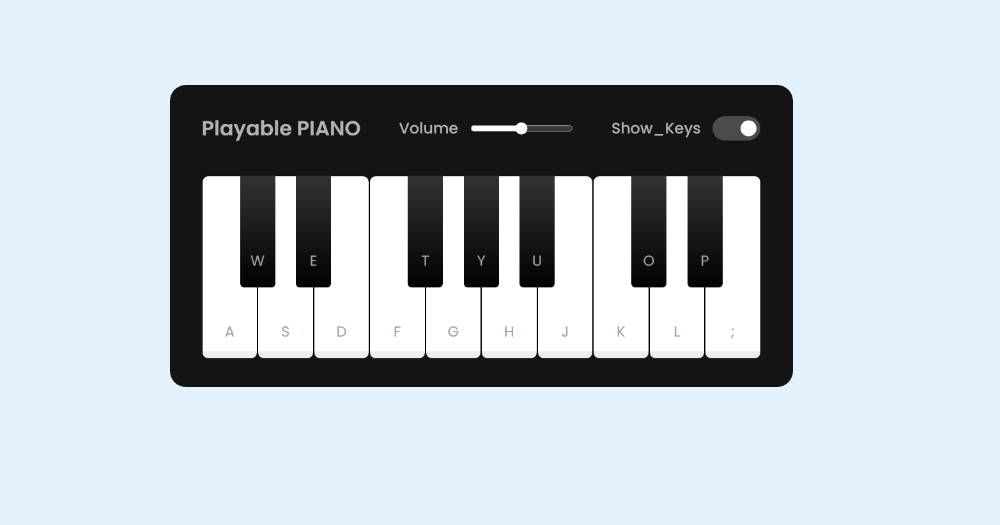

# JS Piano WebApp 🎹

A fun and interactive piano web application built using **HTML**, **CSS**, and **JavaScript**.  
This responsive app allows users to play notes using both their **keyboard** and **mouse**.

---

## 🎯 Features

- 🎵 Play piano notes using your keyboard or mouse
- 🎹 Realistic audio feedback with key mapping
- 📱 Fully responsive design for mobile and desktop
- ⚡ Smooth interactions and clean UI

---

## 🖼️ Preview

<details>
  <summary>Click For Image Preview</summary>

  <br>

  

</details>

---

## 📁 Folder Structure

```
js-piano-webapp/
├── index.html
├── style.css
├── script.js
└── README.md
└── Preview.png
```

---

## 🚀 How to Use

1. Clone or download this repository.
2. Open `index.html` in your browser.
3. Use the on-screen keys or your keyboard to play notes.

---

## 🛠️ Tech Stack

- HTML5
- CSS3
- JavaScript (Vanilla)

---


## 🙌 Acknowledgements

Inspired by simple piano UIs and JavaScript event listeners. Made with ❤️ by Shaswat.
